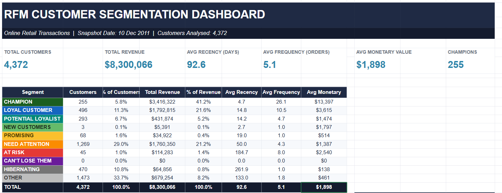

# 📊 RFM Customer Segmentation Dashboard

An RFM (Recency, Frequency, Monetary) analysis project designed to segment customers based on their purchasing behavior and identify high-value, loyal, and at-risk customer groups.

## 🎯 Business Problem

The business needed to understand customer purchasing behavior and identify different customer segments based on their transaction history.

Without customer segmentation, it is difficult to identify high-value customers, retain loyal customers, or take action toward customers who may be at risk of becoming inactive.

## 💡 Project Objective

- Segment customers based on purchasing behavior
- Identify high-value and loyal customers
- Detect customers requiring retention attention
- Analyze customer recency, frequency, and monetary value
- Support targeted customer engagement strategies

## 🛠️ Tools & Technologies

- Microsoft Excel
- Pivot Tables
- RFM Analysis
- Data Cleaning
- Data Visualization

## 📐 RFM Methodology

### Recency
Measures how recently a customer made a purchase.

### Frequency
Measures how frequently a customer placed orders.

### Monetary
Measures the total amount spent by a customer.

Customers were scored and segmented based on their RFM characteristics.

## 📊 Customer Segments

The analysis categorizes customers into segments including:

- Champions
- Loyal Customers
- Potential Loyalists
- New Customers
- Promising
- Need Attention
- At Risk
- Can't Lose Them
- Hibernating
- Other

## 📈 Dashboard Highlights

- Total Customers
- Total Revenue
- Average Recency
- Average Frequency
- Average Monetary Value
- Champions Customer Count
- Customer Segment Distribution
- Revenue contribution by segment
- Average RFM metrics by segment

## 🔍 Key Insights

The dashboard helps identify:

- High-value customers contributing significantly to revenue
- Loyal customers with frequent purchasing behavior
- Customers requiring retention strategies
- Recently acquired customers
- Inactive or hibernating customers
- Revenue contribution across customer segments

## 📷 Dashboard Preview

## 📂 Project Files

| File | Description |
|------|-------------|
| `RFM_Dashboard.xlsx` | Excel dashboard containing RFM analysis and visualizations |
| `rfm_dataset.xlsx` | Source transaction dataset |
| `RFM_Dashboard.png` | Dashboard preview |
| `README.md` | Project documentation |

## 🔄 Project Workflow

1. Imported the online retail transaction dataset
2. Cleaned and prepared the transaction data
3. Calculated Recency, Frequency, and Monetary metrics
4. Created customer-level RFM analysis
5. Assigned RFM scores and customer segments
6. Built Pivot Tables for customer analysis
7. Developed the RFM Customer Segmentation Dashboard
8. Analyzed customer segments and revenue contribution
9. Generated actionable customer insights

## 🧠 Skills Demonstrated

- Excel
- Data Cleaning
- Data Analysis
- RFM Analysis
- Customer Segmentation
- Pivot Tables
- KPI Development
- Data Visualization
- Business Analysis

## 📌 Dataset

The analysis is based on online retail transaction data containing customer purchase information.

## 👨‍💻 Project Type

Personal Data Analytics Project

---

### ⭐ Author

**Maksudur Rahman**

Data Analyst | Power BI | SQL | Excel | DAX
